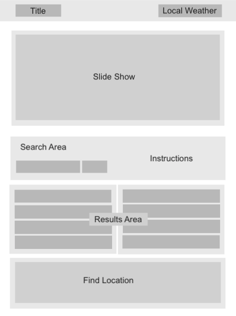

# Project_1_Group: Valshop 

When searching for and comparing items online, a consumer is often at a disadvantage as such information is generally located across many sites and different forums. Our solution is to create a web application where the user can select from various product categories and have the features and  pricing data displayed in one location. 

https://tpenick.github.io/Project_1_Group/
## User Story

```
AS A price conscious consumer
I WANT to be able to price check items that I am interested in purchasing across multiple outlets
SO THAT I can ensure I am getting the best price and value
```

## Acceptance Criteria

```
GIVEN an application with form inputs
WHEN I select from a predined set of product categories
THEN I am presented with a data set that contains the feature listing and pricing information on several products from the available retailers. 
WHEN I select a given product
THEN I am directed to the offering retailer's site, where I make a purchase
GIVEN the current weather conditions in my area
THEN I can use that information to determine if I want to make my purchase online or in the store
WHEN I input a given retailer's name
THEN I am presented with that retailer's address
```

The following image demonstrates the application functionality:



## Review

* URL of the deployed application
(https://tpenick.github.io/Project_1_Group/)

* URL of the GitHub repository.
(https://github.com/tpenick/Project_1_Group)

---
© 2020 Valshop, Inc., Group 7 - Venus, Logique, Tim, Hatem, Muhammad

